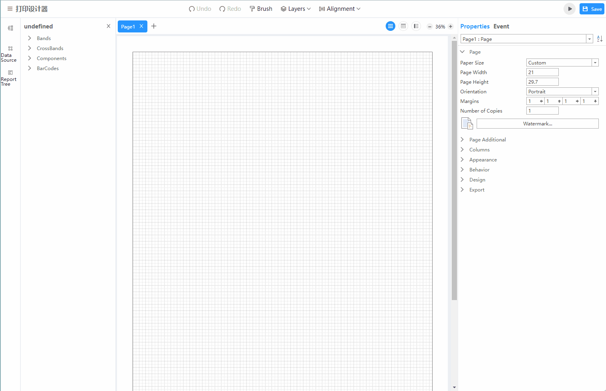

## reproduce the error
### 1. install local web server
```
npm install
```
### 2. start web server
```
npm run serve
```
### 3. open the link in browser
```
 http://127.0.0.1:8081
```
### 4. open ERROR_DEMO.mrt in print designer
ERROR_DEMO.mrt is in folder `mrt`

### 5. click preview button
